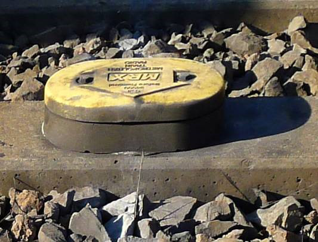

# Locations
The CSVs in `current/` contain all the locations I know of for the respective regions (and their coordinates) as of the time they were updated. This is not an exhaustive list as the only way to gather these is by constantly monitoring the `vehiclepos` feed for new locations, however after doing this for a few years at this point, I generally only record new locations every few weeks, often as a result of changes on the network.

Many locations across the network are only triggered quite rarely, for example in rarely-used or booked-out sidings or the non-usual running direction on bidirectional track, so it's hard to know whether they still exist. Unless I have a sure reason to believe they've been decommissioned/superseded, I've left them in the region CSVs. Some of these questionable locations are mentioned in the list of regions below.

Decommissioned and superseded locations are available in `old/`.

A handful of locations report on [Null Island](https://en.wikipedia.org/wiki/Null_Island), mostly on the South Coast, where the limitation of reporting to timetabled services only means some of these locations(many of which are in sidings not normally used by passenger services) I've only seen once or twice the whole time I've been monitoring the feed. Through [DRKDs](https://railsafe.org.au/maps-and-appendices) and [other diagrams](https://www.sa-trackandsignal.net/), I've written descriptions(of varying certainty) of their location in `NullIslandDescriptions.csv`. I haven't assigned coordinates but will happily accept a PR if that's something you want to do :wink:.

It should also be noted that the coordinates as reported in the feed are wrong for some locations, notably two in the [Lidcombe region](#lidcombe), but there are others. All the coordinates in my CSVs are as was most recently reported in the feed.

Where the location name is a signal number, this is generally the next signal the train will pass, and the coordinates are generally the location of that physical signal, that being the furthest forward a train could be while still reporting that position.

## ATRICS regions
Within ATRICS territory, positions are derived from signalling (track circuits, axle counters, etc). All track occupations are reported, be they freight, passenger (in and out of service), or maintenance. Vehicles that don't reliably trip track circuits such as hi-rails may not report.

### Ashfield
- Macdonaldtown – Burwood

### Blacktown
- Seven Hills – Blacktown
- Blacktown – Richmond

### CampsieBankstown (decommissioned)
- Canterbury – Birrong

Decommissioned September 2024 with Metro conversion, Birrong – Bankstown transferred to Sefton.

### CentralCoast
- Woy Woy – Wyee

### EastHills
- Bardwell Park – Holsworthy

### Glenfield
- Casula – Macarthur
- Glenfield – Leppington

### Granville (decommissioned)
- Clyde – Seven Hills
- Granville – Merrylands

Granville signal box was decommissioned in March 2023, upon which its locations were moved to the Lidcombe region, with some tweaks and shuffling with Liverpool.

### Hornsby
- Normanhurst – Wondabyne

### Hurstville
- Allawah – Jannali

### Lidcombe
- Flemington – Seven Hills
- Lidcombe – Olympic Park
- Lidcombe – Berala
- Granville – Merrylands

Two notable misplaced locations:

- `Lidcombe.S17.3 Loc` reports between Yennora and Fairfield, but is actually just before Pendle Hill on the Down Suburban
- `Lidcombe.S18.1 Loc` reports between Fairfield and Canley Vale, but is actually between Pendle Hill and Toongabbie on the Down Suburban

### Liverpool
- Merrylands – Liverpool

### Mountains
- Doonside – Newnes Junction

### NewSouthernRailway
- Green Square – Wolli Creek

### NorthShore
- Wollstonecraft – Waitara

### NorthSydney
- Milsons Point – Waverton
- Waverton – Lavender Bay (North Sydney Car Sidings)

### Sefton
- Berala – Carramar
- Regents Park – Bankstown
- ARTC interface Sefton Park (limited)

The Sefton region has a few locations in ARTC-operated territory near Sefton Park Junction and Leightonfield freight yard, which I assume are pushed from ARTC's Phoenix control system to ATRICS for the convenience of signallers accepting movements across the track interface. The resolution of locations here is much lower than on the Sydney Trains network; only a select few locations are pushed.

### Strathfield
- Strathfield – Homebush
- Strathfield – Thornleigh

### Sutherland
- Jannali – Waterfall
- Sutherland – Cronulla

### Sydenham
- Erskineville – Allawah
- Erskineville – Bondi Junction
- Meeks Rd Junction
- ARTC interface Sydenham, Botany (limited)
- Tempe – Turrella

Martin Place turnback is currently booked out of use, `Sydenham.SY730 Loc` hasn't reported since 18 July 2023.

Similar to Sefton, the Sydenham region has a few locations on the ARTC-operated Goods and Botany lines, though the following locations haven't reported since 28 April 2023 for no reason I've been able to figure out (oddly enough some SouthCoast locations also stopped reporting at the same time):

- `Sydenham.CR720 LOC`
- `Sydenham.CR718 LOC`
- `Sydenham.CR714/CR719 LOC`
- `Sydenham.CR713 Entry LOC`
- `Sydenham.CR709 Entry LOC`
- `Sydenham.CR715/CR712 LOC`
- `Sydenham.CR711/SM708 LOC`
- `Sydenham.CR717 LOC`

### Sydney
- Macdonaldtown – Milsons Point
- City Circle
- Sydney yard (Central)

## Non-ATRICS regions
### MetroNet
- Wyong – Newcastle Interchange
- Zig Zag – Lithgow

MetroNet positions are derived from track-mounted transponders which transmit their ID to vehicles as they pass over. This is then conveyed over radio to a base station. This system also allows the train radio to automatically call the correct signaller for the current area. The old analog radio system is where the name MetroNet originates, the new system is DTRS (Digital Train Radio System).

As they depend on radio transmissions, MetroNet locations can sometimes be delayed or unreliable. The `vehiclepos` feed only includes MetroNet positions for trips included in the static GTFS timetable(or added ad-hoc in the `realtime` feed), meaning freight(except for [F and W sets](../README.md#f-and-w-sets)) and maintenance vehicles are generally not shown.

The MetroNet positioning system is still active across the Sydney Trains network, however due to its relative coarseness and unreliability, it's only incorporated into the `vehiclepos` feed for the areas above, where no other position source has been implemented.

There is also the location `MetroNet.506` which, based on the trains that pass it, I've deduced to be on 255 points near Coniston station on the South Coast, however it reports coordinates nearly 190km away on an unelectrified part of the Hunter line near Hamilton. Given that this is the only MetroNet location reported on the South Coast, I can only assume it's included by mistake.

### NIF
- Wyong – Newcastle Interchange

In November 2023, locations of the form `NIF.CCN2_0200` began appearing on the Central Coast & Newcastle line, where `CCN1` seems to be locations on the down line, and `CCN2` ones on the up line. These locations are only reported for New Intercity Fleet (aka D set, Mariyung) trains and given the coverage area I suspect this is a replacement for MetroNet, though NIFs did report MetroNet locations prior to this change, and still continue to afterwards (though much less frequently than prior to the change and other trains do).

I don't have any sure knowledge of how these positions are derived, though given they have a higher density than MetroNet and each location name still correlates with an exact pair of coordinates, my guess is that they are based on ATP balises, possibly with some input from onboard GPS.

I've seen NIFs appear at these locations with both standard trip IDs and NonTimetabled IDs.

No locations in the NIF region have reported since 24 June 2024, which seems to roughly coincide with a significant decrease in reliability of MetroNet location reports in the Wyee – Newcastle Interchange area.

### SouthCoast
- Helensburgh – Kiama
- Coniston – Port Kembla
- Unanderra – Farmborough Heights

> [!NOTE]
> Since the transfer of control of the South Coast branch line to Homebush OMCC on 7 Sep 2024, trains have not reported between Dapto and Kiama (inclusive). I've [raised this](https://opendataforum.transport.nsw.gov.au/t/sydney-trains-vehiclepos-feed-is-missing-trains-south-of-dapto/4495) with the open data team and expect it to be fixed sooner or later.

SouthCoast positions are, like ATRICS positions, derived from signalling, however only timetabled services are reported like in the MetroNet area.

These locations haven't reported since 28 April 2023, along with some Sydenham locations:

Up line between Otford and Helensburgh:
- `SouthCoast.HELS-746-741`
- `SouthCoast.METR-737`
- `SouthCoast.METR-736`
- `SouthCoast.OTFD-730`
- `SouthCoast.OTFD-718-709`
